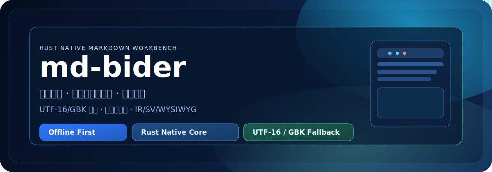

# md-bider

<div align="center">
  

  <p>
    <strong>本地优先、中文优先、写作优先的 Markdown 桌面工作台</strong><br/>
    Rust 原生内核 + 离线资源内嵌 + 多模式编辑，面向真实本地文件流。
  </p>

  <p>
    
    
    
    
    
    
    
    
  </p>
</div>

## 我们的亮点

<div align="center">
  <table>
    <tr>
      <td width="33%"><strong>01 打开即写</strong><br/>默认进入 <code>IR</code> 所见即所得，不先折腾模式。</td>
      <td width="33%"><strong>02 真本地工作流</strong><br/>标签页并行 + 新建/打开/保存/另存为 + 命令行直开。</td>
      <td width="33%"><strong>03 中文稳定</strong><br/><code>UTF-16 BOM</code> + 编码探测 + <code>GBK</code> 回退。</td>
    </tr>
  </table>
</div>

## 为什么 Rust 是优势

1. 性能更轻快  
相比典型 Web 壳方案，启动和内存占用更可控，长期编辑更稳。

2. 稳定性更高  
Rust 编译期约束能提前规避一类内存和并发错误，桌面工具更可靠。

3. 分发更干净  
配合离线资源内嵌，打包结果更适合“下载即用”的本地工具场景。

## 对比常见 Markdown 编辑器

| 维度 | 常见 Markdown 编辑器（普遍情况） | md-bider |
| --- | --- | --- |
| 首屏体验 | 进入后先切换模式或偏预览导向 | 默认 `IR`，打开即写 |
| 多文件并行 | 部分工具偏单文档 | 标签页并行编辑 |
| 中文旧编码兼容 | 默认 UTF-8，异常时需手动处理 | `UTF-16 BOM` + 探测 + `GBK` 回退 |
| 离线能力 | 插件/资源依赖外网时会受限 | 编辑资源内嵌，离线可运行 |
| 桌面核心取向 | 浏览器生态优先 | Rust 原生内核 + 本地文件流优先 |

## 功能总览

| 能力 | 说明 |
| --- | --- |
| 编辑模式 | `SV` 分栏、`IR` 所见即所得、`WYSIWYG` 富文本 |
| 标签页 | 多文档并行编辑，支持关闭与切换 |
| 文件操作 | 新建、打开、保存、另存为 |
| 快捷键 | `Ctrl+N / Ctrl+O / Ctrl+S / Ctrl+Shift+S / Ctrl+W` |
| 命令行启动 | `md-bider.exe <file.md>` 直接打开文件 |
| 离线运行 | 编辑器脚本、样式、语言包内嵌 |

## 下载与发布

- 最新稳定版：<https://github.com/cloveric/md-bider/releases/latest>
- Windows：`md-bider-vX.Y.Z-windows-x64.zip`，解压后运行 `md-bider.exe`
- macOS：`md-bider-vX.Y.Z-macos-*.zip`，解压后将 `md-bider.app` 拖入 `Applications`

## 快速开始

```powershell
git clone https://github.com/cloveric/md-bider.git
cd md-bider
cargo build --release
```

- Windows 运行：`.\target\release\md-bider.exe`
- macOS 运行：`./target/release/md-bider`
- 带文件启动：`md-bider.exe C:\path\to\README.md`

## 技术架构

```text
Rust (tao + wry) Desktop Shell
        |
        | IPC (JSON commands/events)
        v
Embedded Editor Shell (HTML/CSS/JS)
        |
        +-- local file IO (UTF-8 + fallback)
        +-- offline embedded assets
```

关键模块：

- `src/main.rs`：应用入口、窗口生命周期、IPC 路由
- `src/desktop.rs`：IPC 协议定义（命令/事件）
- `src/io.rs`：文件读写与编码回退
- `assets/editor_shell.html`：编辑器 UI 与交互逻辑
- `assets/vendor/*.b64`：内嵌资源（脚本/样式/语言包）

## 路线图

- 文档层：补充使用手册与常见问题
- 产品层：更多阅读/排版预设
- 工程层：打包流程与版本发布自动化

详见 [CHANGELOG.md](CHANGELOG.md) 与 [CONTRIBUTING.md](CONTRIBUTING.md)。

## License

MIT
